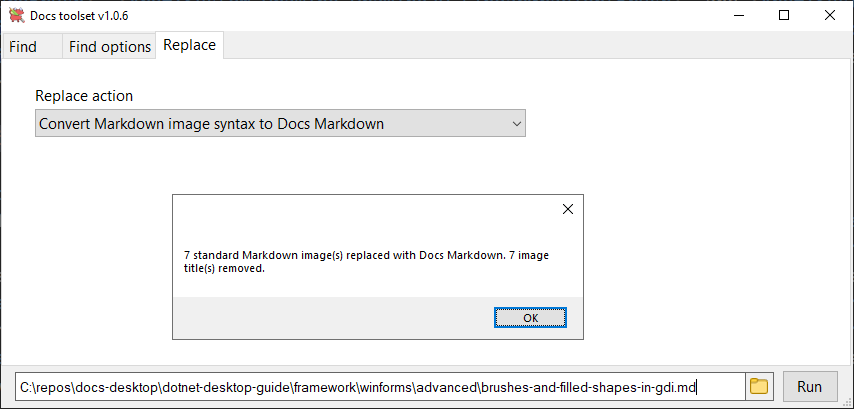
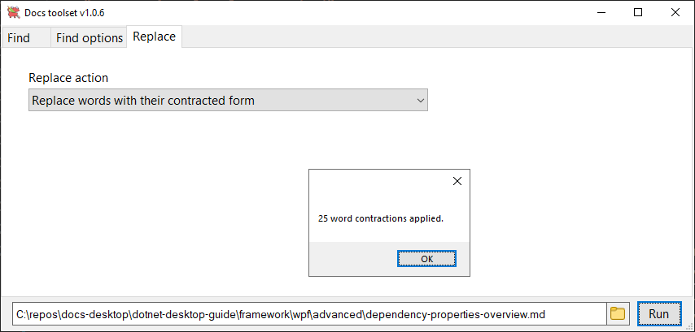

# Docs toolset

Available (free) in the [Microsoft Store](https://www.microsoft.com/en-us/p/docs-toolset/9N2HN8GZGFJL).

## Summary

An open source toolset for editing and proofreading documents. 

## Features

- Search for non-ideal words and phrases in a text document and display suggested replacements. You can edit the non-ideal word/phrase list, along with suggested replacements.
- Convert Markdown image syntax to Docs Markdown.
- Convert legacy code-snippet reference syntax to Docs Markdown.
- Replace words with their contracted form.

## Getting started

### Search for non-ideal words and phrases in a text document

1. For first time use, enter the phrase file path in the **Find options** tab of the UI. See [Editing the phrase file](#editing-the-phrase-file).

1. Select the folder button to browse to a Markdown or other text file, and choose **Run**.

    

#### Editing the phrase file

1. In the **Find options** tab of the UI, select the folder button to browse to the Excel phrase file. By default, the phrase file repo path is `docs-toolset\code\docs-toolset-proj\Phrases\phrases.xlsx`.

    

1. Select **Open** to open the Excel file.

1. Add or change entries. For each row:
    - Column A is a word or phrase that you want to search for (case insensitive for non-regex searches).
    - Column B is the replacement suggestion (no replacement is made).
    - Column C is ignored unless its content is "regex", in which case the column A value can be a regular expression. The use of regular expressions supports case-sensitive, wildcard, lookahead searches, and more. For example, `(?<!by )using` looks for the word **using** when it isn't preceded by the word **by**.

    

1. Save and close the Excel phrase file.

### Convert Markdown image syntax to Docs Markdown

1. In the **Replace** tab of the UI, select the **Convert Markdown image syntax to Docs Markdown** option, and choose **Run**. You'll be prompted whether to add borders (default is `true`). 

    

Here's the conversion syntax:

    | **Markdown image syntax** | **Docs Markdown image syntax** |
    |-|-|
    | \!\[`alttext`\]\(`imgpath`\) or  \!\[`alttext`\]\(`imgpath` `imgtitle`\)| \:\:\:image type="content" source="`imgpath`" border="`true/false`" alt-text="`alttext`"\:\:\: |

    Image titles aren't supported by Docs Markdown and get removed.

### Convert legacy code-snippet reference syntax to Docs Markdown

1. In the **Replace** tab of the UI, select the **Convert legacy code snippet reference syntax to Docs Markdown** option, and choose **Run**.

    

Here's the conversion syntax:

    | **Legacy snippet syntax** | **Docs Markdown snippet syntax** |
    |-|-|
    | \[\!code-\<lang\>(\<filepath\>)] or  \[\!code-\<lang\>\[\<snippetname\>\](\<filepath\>)\] or  \[\!code-\<lang\>(\<filepath\#\<snippetid\>)\] or  \[\!code-\<lang\>\[\<snippetname\>\](\<filepath\>#\<snippetid\>)\] | \:\:\:code language=\"\<lang\>" source="\<filepath\>" id="<snippetid\>"\:\:\: |

### Replace words with their contracted form

1. In the **Replace** tab of the UI, select the **Replace words with their contracted form** option, and choose **Run**.

    

Here's the list of contracted word forms:

<table>
  <tr><td>aren't</td><td>can't</td><td>couldn't</td><td>didn't</td><td>doesn't</td><td>don't</td><td>here's</td></tr>
  <tr><td>isn't</td><td>it's</td><td>let's</td><td>shouldn't</td><td>that's</td><td>there's</td><td>they're</td></tr>
  <tr><td>won't</td><td>wouldn't</td><td>you'll</td><td>you're</td><td>you've</td><td></td><td></td></tr>
</table>

## Manually compile a single file executable

Although it's easier to install the app from the Microsoft Store, you can compile and install the app using Visual Studio.

### Prerequisites

- [.NET 5+](https://dotnet.microsoft.com/download)
- [Visual Studio 2019+](https://visualstudio.microsoft.com/vs/)

### Create an executable

1. Open the project in Visual Studio.

1. From the menu bar, choose **Build** > **Publish...**.

1. Choose the **Publish your app to a local folder** option, then select **Finish**.

1. Choose **Show all settings**.

1. Choose **Framework-dependent**, **Produce single file**, and **win-x64** in the profile settings, and note the **Target location** of the compiled executable.

1. Choose **Publish**.
